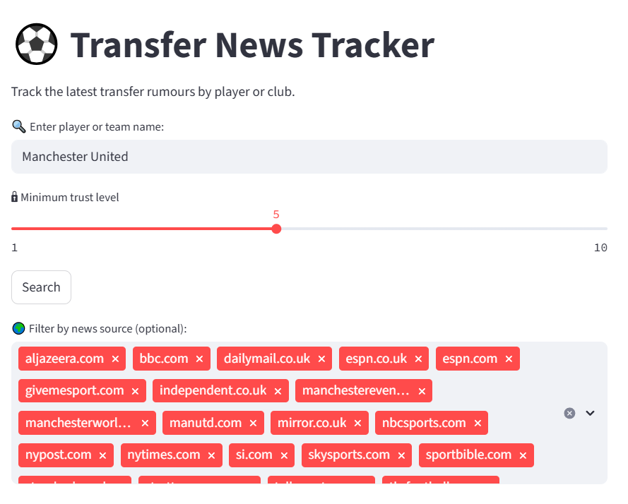
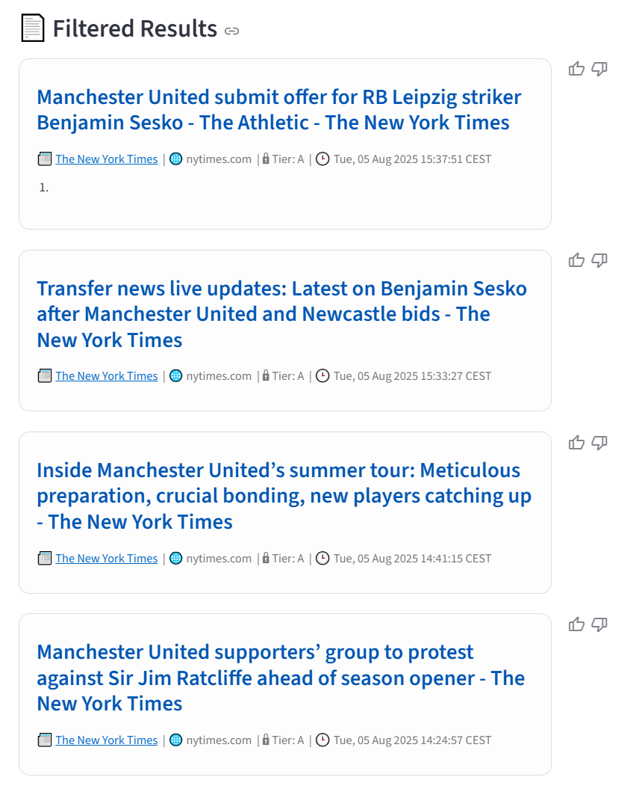

# Transfer News Tracker

A Streamlit web app that helps you track football transfer rumors by querying Google News RSS for players or clubs, and showing a filtered list based on community-rated trust scores.

## Features

- Search Google News for football transfer articles by player or team.
- Displays article title, snippet, source, and publication date.
- Assigns a trust tier (A–U) to each source based on up/down votes.
- Allows users to vote on source credibility (via thumbs up/down).
- Persists trust levels and votes using local JSON files.
- Built with Streamlit and deployable via Streamlit Cloud or locally.

## Screenshots

### Player Input and Trust Filter Configuration


### Filtered Transfer News Results


## Demo

Example usage:
- Input a player name like `Arda Güler`
- See transfer rumors across sources
- Filter by trust level and domain

## Setup

Clone the repo and install dependencies:

```bash
git clone https://github.com/Wirales/transfer-news-tracker.git
cd transfer-news-tracker
pip install -r requirements.txt
```

Then launch the app:

```bash
streamlit run app.py
```

## File Structure

```
.
├── app.py                  # Main Streamlit app
├── core/
│   └── trust.py            # Trust tier logic
├── data/                   # JSON-based persistent store
│   ├── trust_levels.json
│   ├── trust_votes.json
│   └── unknown_sources.json
├── assets/                 # UI icon and screenshots
│   ├── transfer_icon.png
│   ├── screenshot_input_config.png
│   └── screenshot_results_view.png
└── requirements.txt
```

## Trust Scoring Logic

- Sources start unranked (U).
- Voting is per domain.
- If enough users vote positively, the domain is promoted and assigned a trust score (e.g., +5).
- Trust tier is derived from score:
  - A (9–10), B (7–8), C (5–6), D (1–4), U (Unranked)

## To-Do / Ideas for Improvement

- Deploy online via Streamlit Cloud or HuggingFace Spaces
- Add autocomplete for known players/teams
- Deduplicate or cluster related articles
- Add login to persist votes per user
- Display vote and promotion history

## Licensing and Usage

This project is shared for **demonstration purposes only** as part of a developer portfolio.

Reusing, modifying, or redistributing the code **without explicit permission** is not allowed at this time.  
If you're interested in collaboration or licensing, please contact the author directly.
